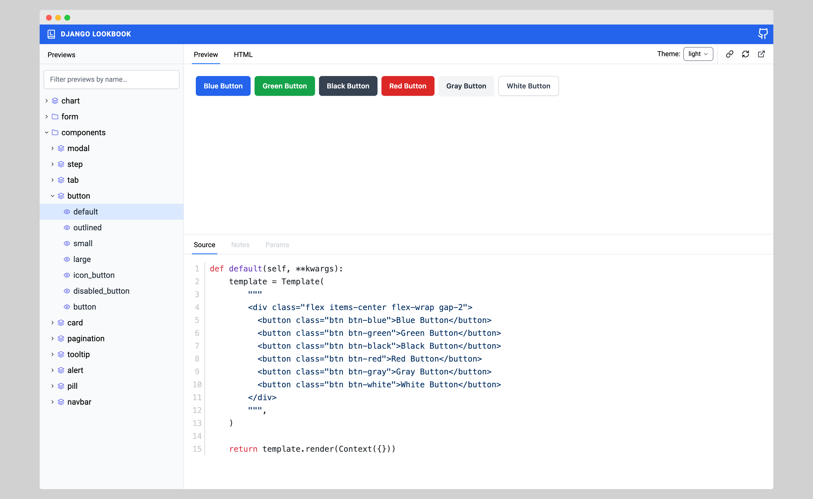
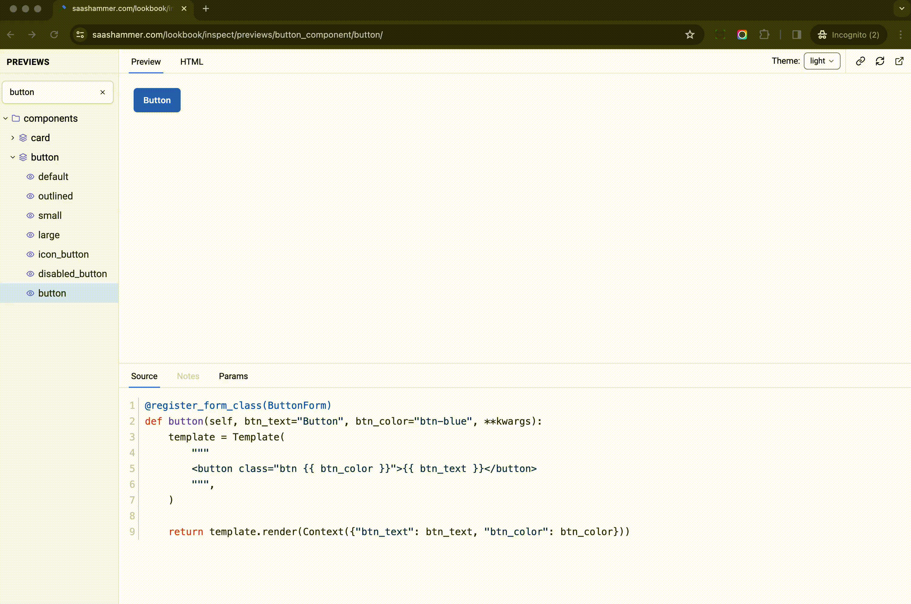

<h1>Django Lookbook</h1>

Empower your Django development with this pluggable app for creating a robust component library. Includes preview system, documentation engine, and parameter editor for building modular UI effortlessly.

<strong><a href="https://django-lookbook.readthedocs.io/en/latest/">Documentation</a> &nbsp;|&nbsp; <a href="https://saashammer.com/lookbook/">Demo site</a></strong>

## Features

- Auto-detect and render the previews
- Filter previews in real-time
- Draggable and resizable layout
- Auto extract documentation from the preview doc string
- Powerful parameter editor, which allows the user to check UI in real-time (for example: change button text and color)
- This app is **pluggable** and can be integrated with any Django project

## Techs

This project is a reusable Django app that uses the following technologies:

1. Tailwind CSS for styling
2. Stimulus JS for interactivity
3. django-viewcomponent for preview discovery and rendering

## Storybook Controls

> Storybook Controls gives you a graphical UI to interact with a component's arguments dynamically without needing to code. It creates an addon panel next to your component examples ("stories"), so you can edit them live.

django-lookbook provides simple way to let developer use classic Django form to add `Params Editor` to the preview, which allow user to interact with the preview in real-time.

## Special Thanks

This project is heavily inspired by [lookbook](https://github.com/lookbook-hq/lookbook) from the Rails community.
