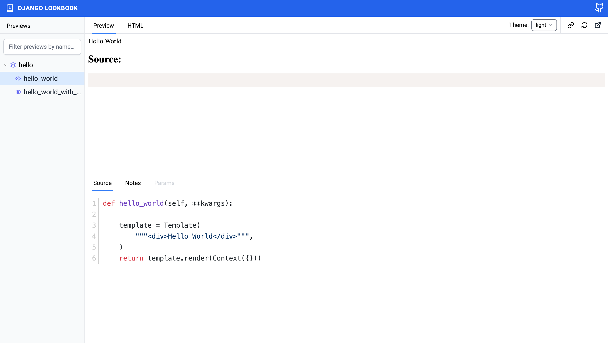
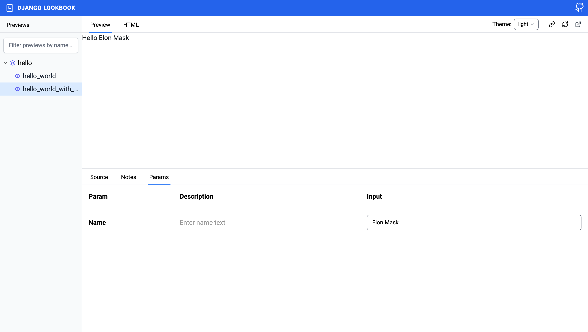

# Installation

```shell
$ pip install django-lookbook
```

`django-viewcomponent` will also be installed as a dependency.

Then add the app into `INSTALLED_APPS` in settings.py

```python
INSTALLED_APPS = [
    ...,
    "django_viewcomponent",
    "django_lookbook",
]
```

Add code below in settings.py

```python
VIEW_COMPONENTS = {
    # we will put previews in this directory later
    "preview_base": ["previews"],
}

# to make iframe work
X_FRAME_OPTIONS = "SAMEORIGIN"
```

Update urls.py

```python
from django.contrib import admin
from django.urls import path, include

urlpatterns = [
    path('admin/', admin.site.urls),
    path("previews/", include("django_viewcomponent.urls")),      # new
    path("lookbook/", include("django_lookbook.urls")),        # new
]
```

Next, let's create *previews/hello_preview.py*

```python
from django.template import Context, Template
from django_viewcomponent.preview import ViewComponentPreview


class HelloComponentPreview(ViewComponentPreview):
    def hello_world(self, **kwargs):
        """
        This is a simple test for you to check how doc of the preview works
        """
        template = Template(
            """<div>Hello World</div>""",
        )
        return template.render(Context({}))

    def hello_world_with_name(self, name=None, **kwargs):
        """
        This preview is to display hello world for a specific name
        """
        name = name if name else "Michael Yin"
        template = Template(
            """<div>Hello {{ name }}</div>""",
        )
        return template.render(Context({'name': name}))
```

Notes:

1. We create `HelloWorldComponentPreview` which inherits from `ViewComponentPreview`, the class name `HelloComponentPreview` can be seen as a `group` which can contains multiple previews.
2. We define two methods `hello_world` and `hello_world_with_name` which will be used to render the preview

```bash
├── previews
│   └── hello_preview.py
```

```bash
# create db tables and launch Django server
(venv)$ python manage.py migrate
(venv)$ python manage.py runserver
```

Now please check on [http://127.0.0.1:8000/lookbook](http://127.0.0.1:8000/lookbook):

1. The preview has been automatically detected and can be seen in the left sidebar
2. You can see the UI of the preview on the right side and final HTML source code can also be seen
3. The docstring of the preview has been extracted and display in the `Notes` tab, `Markdown` syntax is supported



Each time we visit a preview, the method would be called and the final result would be displayed in the top iframe.

## Override Template

In some cases, you might need to render HTML code which need work with CSS and JS. You can override the `preview` template to include them.

Create *django_viewcomponent/preview.html* in the project `templates` directory

```html
<!DOCTYPE html>
<html lang="en">
<head>
  <meta charset="UTF-8">
  <meta http-equiv="X-UA-Compatible" content="IE=edge">
  <meta name="viewport" content="width=device-width, initial-scale=1.0">
  <link href="https://cdn.jsdelivr.net/npm/bootstrap@5.2.3/dist/css/bootstrap.min.css" rel="stylesheet"
        integrity="sha384-rbsA2VBKQhggwzxH7pPCaAqO46MgnOM80zW1RWuH61DGLwZJEdK2Kadq2F9CUG65" crossorigin="anonymous">
</head>
<body>

<div>
  {{ preview_html }}
</div>

<script src="https://cdn.jsdelivr.net/npm/bootstrap@5.2.3/dist/js/bootstrap.bundle.min.js"
        integrity="sha384-kenU1KFdBIe4zVF0s0G1M5b4hcpxyD9F7jL+jjXkk+Q2h455rYXK/7HAuoJl+0I4"
        crossorigin="anonymous"></script>
</body>
</html>
```

1. We import Bootstrap CSS and JS to the page.
2. `preview_html` is the HTML generated by the preview method.

Now if we refresh the page and check again, the `preview` HTML should be rendered with Bootstrap CSS and JS.

If you have other frontend assets such as Alpine.js, jQuery or CSS file, **you should remember to include them in this template file**.

### Params Editor

Next, let's make our preview work with dynamic parameters.

Update *previews/hello_preview.py*

```python
from django import forms
from django.template import Context, Template
from django_viewcomponent.preview import ViewComponentPreview
from django_lookbook.utils import register_form_class     # new


class HelloForm(forms.Form):                     # new
    """
    This is to show how to add parameter editor to preview
    """
    name = forms.CharField(
        label="Name",
        max_length=100,
        help_text="Enter name text",
        initial="",
    )


class HelloComponentPreview(ViewComponentPreview):
    def hello_world(self, **kwargs):
        """
        This is a simple test for you to check how doc of the preview works
        """
        template = Template(
            """<div>Hello World</div>""",
        )
        return template.render(Context({}))

    @register_form_class(HelloForm)       # new
    def hello_world_with_name(self, name=None, **kwargs):
        """
        This preview is to display hello world for a specific name
        """
        name = name if name else "Michael Yin"
        template = Template(
            """<div>Hello {{ name }}</div>""",
        )
        return template.render(Context({'name': name}))
```

Notes:

1. We defined a `HelloForm`, which is a regular Django form, nothing special.
2. Use `@register_form_class(HelloForm)` to attach the form class to the method `hello_world_with_name`

If we check the `hello_world_with_name` preview's `Params` tab, we can see the form.

And then, let's input `Elon Musk` in the `name` field, we can see the top iframe is also updated in real-time.



In this case, the `name` field value is passed to the `hello_world_with_name` method, then it can generate HTML according to the value.
