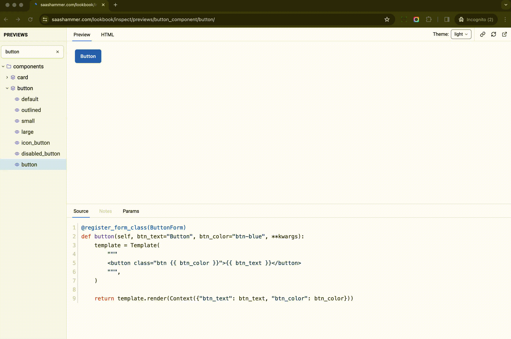
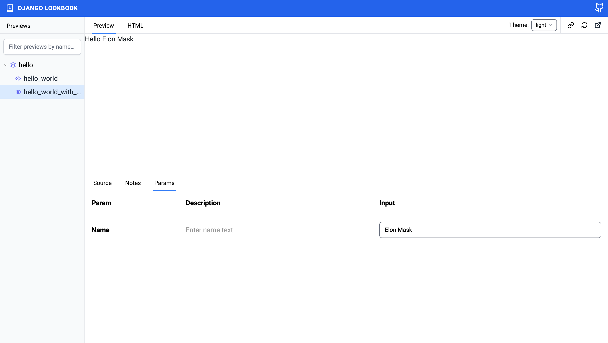

# Dynamic Params

> Storybook Controls gives you a graphical UI to interact with a component's arguments dynamically without needing to code. It creates an addon panel next to your component examples ("stories"), so you can edit them live.

django-lookbook provides simple way to let developer use classic Django form to add `Params Editor` to the preview, which allow user to interact with the preview in real-time.



Let's see how to build a preview with dynamic params.

```python
from django import forms
from django.template import Context, Template
from django_viewcomponent.preview import ViewComponentPreview
from django_lookbook.utils import register_form_class     # new


class HelloForm(forms.Form):                     # new
    """
    This is to show how to add parameter editor to preview
    """
    name = forms.CharField(
        label="Name",
        max_length=100,
        help_text="Enter name text",
        initial="",
    )


class HelloComponentPreview(ViewComponentPreview):

    @register_form_class(HelloForm)       # new
    def hello_world_with_name(self, name=None, **kwargs):
        """
        This preview is to display hello world for a specific name
        """
        name = name if name else "Michael Yin"
        template = Template(
            """<div>Hello {{ name }}</div>""",
        )
        return template.render(Context({'name': name}))
```

Notes:

1. We defined a `HelloForm`, which is a regular Django form, nothing special, the form has `name` field.
2. Use `@register_form_class(HelloForm)` to attach the form class to the method `hello_world_with_name`
3. The preview method has `name` parameter, which is the same as the form field name.
4. If the name is provided, it will be used, otherwise, it will use the default value `Michael Yin`.

And then, let's input `Elon Musk` in the `name` field of the `Params` tab, we can see the top iframe is also updated in real-time.



While user typing, the `name` field value is passed to the `hello_world_with_name` method, then the generated HTML will be used to update the preview.
